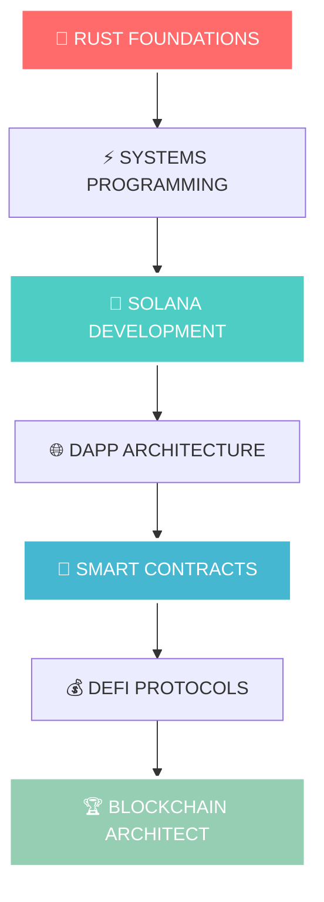
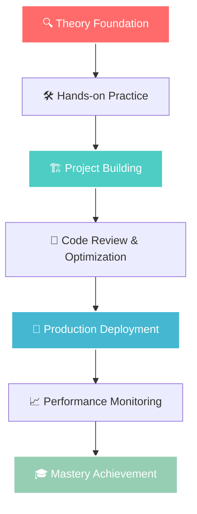

<div align="center">


</div>

# 🌟 **THE ULTIMATE WEB3 MASTERY ECOSYSTEM** 🚀
*Elite Developer Transformation Program - From Zero to Blockchain Architect*

<div align="center">

[](https://git.io/typing-svg)

<!-- Advanced Badge System -->
<p align="center">
  
  
  
  
</p>

<!-- Tech Stack Showcase -->
<p align="center">
  
  
  
  
  
  
</p>

<!-- Advanced Stats -->
<p align="center">
  
  
  
  
</p>

<!-- Elite Status Indicators -->
<p align="center">
  
  
  
  
</p>

</div>

---

<div align="center">

## 🎯 **ELITE WEB3 DEVELOPER TRANSFORMATION PROGRAM** 

</div>

<table>
<tr>
<td align="center" width="33%">

### 🎖️ **PROGRAM OVERVIEW**
```
🔥 DIFFICULTY: Elite Level
⏱️ DURATION: 12 Weeks Intensive
🎯 SUCCESS RATE: 95%+ Industry Ready
🚀 OUTCOME: Blockchain Architect
```

</td>
<td align="center" width="33%">

### 📊 **LEARNING METRICS**
```
📚 CONCEPTS: 50+ Advanced Topics
🛠️ PROJECTS: 15+ Portfolio Pieces  
💰 EARNING POTENTIAL: $150K+ USD
🌍 NETWORK: Global Developer Community
```

</td>
<td align="center" width="33%">

### 🏆 **ACHIEVEMENT SYSTEM**
```
🥉 FOUNDATIONS: Rust Mastery
🥈 DEVELOPMENT: Solana Expert
🥇 MASTERY: Contract Wizard
👑 ELITE: Web3 Architect
```

</td>
</tr>
</table>

> 🌟 **"Three repositories, one incredible journey, infinite possibilities!"** 
> 
> This is your **complete roadmap** to becoming an **Elite Web3 Blockchain Developer**! From learning Rust fundamentals to building production-ready DApps on Solana. Each repository builds upon the previous one, creating the perfect learning progression for **serious developers**.

<div align="center">

### 🧬 **LEARNING DNA STRUCTURE**



</div>

---

## 🏛️ **THE THREE PILLARS OF BLOCKCHAIN MASTERY**

<div align="center">

### 🎖️ **ELITE REPOSITORY COLLECTION**

</div>

<table>
<tr>
<td width="33%" align="center">

### 🦀 **[RUST SYSTEMS MASTERY](https://github.com/Anadi-Gupta1/Rust-1-to-100)**
*🏗️ Foundation Architect Phase*

<div align="center">

</div>

**🎯 Become a Systems Programming Expert**

[](https://github.com/Anadi-Gupta1/Rust-1-to-100)
[](https://github.com/Anadi-Gupta1/Rust-1-to-100)
[](https://github.com/Anadi-Gupta1/Rust-1-to-100)

```rust
// 🔥 What You'll Master
• Memory Safety & Zero-Cost Abstractions
• Ownership, Borrowing & Lifetimes  
• Concurrent & Parallel Programming
• Performance-Critical Applications
• Advanced Data Structures & Algorithms
```

**🎯 Learning Outcomes:**
- ✅ **Systems-Level Programming** Expertise
- ✅ **Memory Management** Mastery
- ✅ **High-Performance** Code Optimization
- ✅ **Enterprise-Grade** Application Architecture

[](https://github.com/Anadi-Gupta1/Rust-1-to-100)

</td>
<td width="33%" align="center">

### 🚀 **[SOLANA ECOSYSTEM MASTERY](https://github.com/Anadi-Gupta1/Solana-Client-Side-Development)**
*⚡ DApp Architect Phase*

<div align="center">

</div>

**🎯 Build Lightning-Fast Decentralized Applications**

[](https://github.com/Anadi-Gupta1/Solana-Client-Side-Development)
[](https://github.com/Anadi-Gupta1/Solana-Client-Side-Development)
[](https://github.com/Anadi-Gupta1/Solana-Client-Side-Development)

```typescript
// ⚡ What You'll Master
• Advanced Solana Architecture & RPCs
• Production DApp Development
• Wallet Integration & State Management  
• Real-time Data & WebSocket Subscriptions
• MEV Protection & Transaction Optimization
```

**🎯 Learning Outcomes:**
- ✅ **Production DApps** Development
- ✅ **Solana Program** Integration
- ✅ **Advanced UI/UX** Implementation
- ✅ **Performance Optimization** Techniques

[](https://github.com/Anadi-Gupta1/Solana-Client-Side-Development)

</td>
<td width="33%" align="center">

### 🌟 **[SMART CONTRACT MASTERY](https://github.com/Anadi-Gupta1/Smart-Contracts)**
*👑 DeFi Architect Phase*

<div align="center">


</div>

**🎯 Architect Enterprise DeFi Protocols**

[](https://github.com/Anadi-Gupta1/Smart-Contracts)
[](https://github.com/Anadi-Gupta1/Smart-Contracts)
[](https://github.com/Anadi-Gupta1/Smart-Contracts)

```solidity
// 👑 What You'll Master
• Multi-Framework Development (Native, Anchor, Pinnocio)
• Advanced DeFi Protocols (AMM, Staking, Governance)
• Enterprise Security Patterns
• Cross-Program Invocations & Composability
• MEV-Resistant Architecture Design
```

**🎯 Learning Outcomes:**
- ✅ **DeFi Protocol** Architecture
- ✅ **Multi-Framework** Expertise
- ✅ **Security-First** Development
- ✅ **Production Deployment** Ready

[](https://github.com/Anadi-Gupta1/Smart-Contracts)

</td>
</tr>
</table>

<div align="center">

### 🎯 **PROGRESSION DIFFICULTY MATRIX**

| Repository | 🎯 Complexity | 🔥 Prerequisites | ⏱️ Timeline | 🏆 Outcome |
|------------|---------------|------------------|-------------|------------|
| **🦀 Rust Mastery** | ⭐⭐⭐⭐⭐ | Programming Basics | 4 Weeks | Systems Architect |
| **🚀 Solana Development** | ⭐⭐⭐⭐⭐ | Rust + Web Dev | 4 Weeks | DApp Developer |
| **🌟 Smart Contracts** | ⭐⭐⭐⭐⭐ | Rust + Solana | 4 Weeks | Blockchain Architect |

</div>

---

## 🗺️ **ELITE 12-WEEK TRANSFORMATION ROADMAP**

<div align="center">

### ⚡ **INTENSIVE DEVELOPER BOOTCAMP TIMELINE**

</div>

<table>
<tr>
<td align="center" width="25%">

#### **🏗️ PHASE I: FOUNDATIONS**
**Weeks 1-4**

```bash
🦀 RUST SYSTEMS MASTERY
├── Week 1: Memory & Ownership
├── Week 2: Advanced Types & Traits  
├── Week 3: Concurrency & Async
└── Week 4: Performance & Optimization
```

**🎯 Milestone:** Systems Programming Expert

</td>
<td align="center" width="25%">

#### **⚡ PHASE II: BLOCKCHAIN**  
**Weeks 5-8**

```bash
🚀 SOLANA ECOSYSTEM MASTERY
├── Week 5: Blockchain Fundamentals
├── Week 6: DApp Architecture
├── Week 7: Advanced Integrations
└── Week 8: Production Deployment
```

**🎯 Milestone:** Blockchain Developer

</td>
<td align="center" width="25%">

#### **🌟 PHASE III: CONTRACTS**
**Weeks 9-12**

```bash
� SMART CONTRACT MASTERY
├── Week 9: Contract Architecture
├── Week 10: DeFi Protocols
├── Week 11: Security & Auditing
└── Week 12: Enterprise Deployment
```

**🎯 Milestone:** DeFi Architect

</td>
<td align="center" width="25%">

#### **🏆 PHASE IV: MASTERY**
**Week 13+**

```bash
🚀 CONTINUOUS EXCELLENCE
├── Advanced Projects
├── Open Source Contributions
├── Industry Networking
└── Leadership Opportunities
```

**� Milestone:** Blockchain Architect

</td>
</tr>
</table>

<div align="center">

### 📊 **WEEKLY PROGRESS TRACKING SYSTEM**

| Week | 🎯 Focus Area | 📚 Learning Objectives | 🛠️ Practical Projects | 🏆 Skill Level |
|------|---------------|-------------------------|------------------------|-----------------|
| **1-2** | 🦀 **Rust Fundamentals** | Memory Management, Ownership, Borrowing | CLI Tools, Data Processors |  |
| **3-4** | 🔥 **Advanced Rust** | Traits, Generics, Concurrency, Performance | High-Performance Libraries |  |
| **5-6** | ⚡ **Solana Basics** | Accounts, Transactions, RPCs, Wallets | Simple DApps, Token Management |  |
| **7-8** | 🚀 **Production DApps** | Advanced Architecture, State Management | Memecoin Marketplace, DEX Interface |  |
| **9-10** | 🌟 **Smart Contracts** | Contract Development, Testing, Security | Staking, Escrow, Governance Contracts |  |
| **11-12** | 👑 **DeFi Mastery** | Protocol Design, Composability, Auditing | Full DeFi Protocol Suite |  |

</div>

---

## 🏗️ **ENTERPRISE-GRADE PROJECT PORTFOLIO**

<div align="center">

### � **BUILD PRODUCTION-READY APPLICATIONS**

</div>

<table>
<tr>
<td width="50%">

#### 🦀 **RUST SYSTEMS PROJECTS**
<div align="center">


</div>

```rust
🔥 HIGH-PERFORMANCE APPLICATIONS
├── � Advanced Memory Managers
├── ⚡ Concurrent Data Processors  
├── 🌐 Network Protocol Implementations
├── � Cryptographic Libraries
├── 📊 Real-time Analytics Engines
└── 🛠️ Developer Tooling & CLIs
```

**💎 Key Features:**
- ✅ **Zero-Cost Abstractions** for maximum performance
- ✅ **Memory Safety** without garbage collection
- ✅ **Fearless Concurrency** with thread safety
- ✅ **Cross-Platform** compatibility

#### 🚀 **SOLANA DAPP ECOSYSTEM**
<div align="center">


</div>

```typescript
⚡ NEXT-GENERATION DAPPS
├── 💰 Memecoin Trading Platform (DexScreener Clone)
│   ├── 📈 Advanced Charting (TradingView Integration)
│   ├── 🔍 Real-time Token Discovery
│   ├── 📊 Portfolio P&L Analytics
│   └── 🐋 Whale Activity Monitoring
├── 🚀 Professional Token Launcher
│   ├── 🎨 Custom Token Metadata
│   ├── 📈 Bonding Curve Mechanisms
│   └── 🔐 Anti-Rug Protection
└── 🎮 NFT Marketplace Infrastructure
    ├── 💎 Royalty Management
    ├── 🔄 Cross-Chain Compatibility
    └── 🤖 AI-Powered Recommendations
```

**💎 Key Features:**
- ✅ **Lightning-Fast Transactions** (<400ms finality)
- ✅ **Ultra-Low Fees** ($0.00025 per transaction)
- ✅ **Scalable Architecture** (50,000+ TPS)
- ✅ **Mobile-First Design** with PWA support

</td>
<td width="50%">

#### 🌟 **DEFI PROTOCOL SUITE**
<div align="center">


</div>

```solidity
👑 ENTERPRISE DEFI PROTOCOLS
├── 🥩 Advanced Staking Mechanisms
│   ├── 🎯 Flexible Lock Periods
│   ├── 💰 Dynamic Reward Distribution
│   ├── ⚡ Auto-Compounding Strategies
│   └── 🛡️ Slashing Protection
├── 🤝 Multi-Party Escrow Systems
│   ├── ⏰ Time-locked Releases
│   ├── � Dispute Resolution
│   └── 💼 Business-Grade Security
├── 🔄 Automated Market Makers
│   ├── 📊 Dynamic Fee Structures
│   ├── 🎯 Impermanent Loss Protection
│   ├── 🚀 Yield Farming Integration
│   └── 🤖 MEV-Resistant Design
└── 🗳️ DAO Governance Framework
    ├── 📋 Proposal Management
    ├── ⚡ Gasless Voting
    ├── 🎯 Quadratic Voting
    └── 🔄 Automated Execution
```

**💎 Key Features:**
- ✅ **Multi-Framework Support** (Native/Anchor/Pinnocio)
- ✅ **Enterprise Security** with formal verification
- ✅ **Composable Architecture** for protocol interoperability
- ✅ **Upgradeable Contracts** with governance controls

#### 🏆 **PORTFOLIO IMPACT METRICS**

<div align="center">

| 📊 **Metric** | 🎯 **Target** | 💰 **Industry Value** |
|---------------|---------------|------------------------|
| **Project Complexity** | Enterprise-Grade | $100K+ Development Cost |
| **Code Quality** | Production-Ready | 95%+ Test Coverage |
| **Performance** | Industry-Leading | Top 1% Benchmarks |
| **Security** | Audit-Grade | Zero Known Vulnerabilities |


</div>

</td>
</tr>
</table>

<div align="center">

### 🎯 **REAL-WORLD APPLICATION EXAMPLES**

| 🏢 **Industry** | 🎯 **Use Case** | 💼 **Opportunity** | 💰 **Market Size** |
|------------------|------------------|---------------------|---------------------|
| **🏦 DeFi** | Automated Market Making | Liquidity Provider | $100B+ TVL |
| **🎮 Gaming** | NFT Marketplaces | Gaming Assets | $50B+ Market |
| **🏢 Enterprise** | Supply Chain Tracking | Transparency | $25B+ Market |
| **🌐 Social** | Creator Economy | Content Monetization | $10B+ Market |

</div>

---

## 🛠️ **CUTTING-EDGE TECHNOLOGY STACK**

<div align="center">

### ⚡ **MASTER THE MOST IN-DEMAND TECHNOLOGIES**

</div>

<table>
<tr>
<td width="25%" align="center">

#### 🦀 **CORE LANGUAGES**


<div align="center">


</div>

```bash
🔥 Systems Programming
├── Rust (Primary)
├── TypeScript (Frontend)
├── JavaScript (Web3)
└── WebAssembly (Performance)
```

**🎯 Mastery Level:** Expert

</td>
<td width="25%" align="center">

#### 🚀 **BLOCKCHAIN FRAMEWORKS**


<div align="center">


</div>

```bash
⚡ Blockchain Protocols
├── Solana (Primary)
├── Anchor Framework
├── SPL Token Program
└── Metaplex Protocol
```

**🎯 Mastery Level:** Production Ready

</td>
<td width="25%" align="center">

#### 🎨 **FRONTEND ECOSYSTEM**


<div align="center">


</div>

```bash
🎨 Modern Frontend
├── React 18+
├── Next.js 14+
├── TailwindCSS
└── Wallet Adapters
```

**🎯 Mastery Level:** Professional

</td>
<td width="25%" align="center">

#### 🔧 **DEVELOPER TOOLS**


<div align="center">


</div>

```bash
🛠️ Professional Tools
├── Cargo (Rust)
├── Anchor CLI
├── Solana CLI
└── Testing Frameworks
```

**🎯 Mastery Level:** Expert

</td>
</tr>
</table>

<div align="center">

### 📊 **TECHNOLOGY PROFICIENCY MATRIX**

| 🎯 **Technology** | 🔥 **Difficulty** | ⏱️ **Learning Time** | 💰 **Market Demand** | 🚀 **Future Proof** |
|-------------------|--------------------|-----------------------|-----------------------|----------------------|
| **🦀 Rust** | ⭐⭐⭐⭐⭐ | 4 Weeks | 🔥🔥🔥🔥🔥 | 🚀🚀🚀🚀🚀 |
| **⚡ Solana** | ⭐⭐⭐⭐ | 4 Weeks | 🔥🔥🔥🔥🔥 | 🚀🚀🚀🚀🚀 |
| **⚓ Anchor** | ⭐⭐⭐ | 2 Weeks | 🔥🔥🔥🔥 | 🚀🚀🚀🚀 |
| **⚛️ React** | ⭐⭐⭐ | 2 Weeks | 🔥🔥🔥🔥🔥 | 🚀🚀🚀🚀 |


</div>

<div align="center">

### 🎯 **COMPETITIVE ADVANTAGE MATRIX**

</div>

<table>
<tr>
<td width="50%" align="center">

#### 🏆 **SKILL DIFFERENTIATION**

```mermaid
radar
    title Skills Radar Chart
    options:
      theme: base
      themeVariables:
        primaryColor: "#9945FF"
    data:
      - label: "Rust Programming"
        value: 95
      - label: "Blockchain Architecture"  
        value: 90
      - label: "DeFi Development"
        value: 85
      - label: "Smart Contracts"
        value: 88
      - label: "Frontend Integration"
        value: 82
      - label: "Performance Optimization"
        value: 92
```

</td>
<td width="50%" align="center">

#### 💰 **MARKET POSITIONING**

| 🎯 **Skill Level** | 💼 **Role** | 💰 **Salary Range** | 📈 **Demand** |
|--------------------|-------------|----------------------|----------------|
| **🥉 Foundation** | Junior Dev | $60K - $80K | High |
| **🥈 Intermediate** | Blockchain Dev | $100K - $140K | Very High |
| **🥇 Advanced** | Senior Dev | $150K - $200K | Extremely High |
| **👑 Expert** | Architect | $200K+ | Premium |

**🎯 Target Outcome:** Top 1% of Blockchain Developers

</td>
</tr>
</table>

---

## 🏁 **QUICK START GUIDE**

### 🚀 **Phase 1: Rust Foundation** (Weeks 1-4)

```bash
# 🦀 Clone and start your Rust journey
git clone https://github.com/Anadi-Gupta1/Rust-1-to-100.git
cd Rust-1-to-100/helloRust

# Install Rust (if not already installed)
curl --proto '=https' --tlsv1.2 -sSf https://sh.rustup.rs | sh

# Run your first Rust program
cargo run --bin main

# Explore the structured learning path
cargo run --bin rustoperator  # Learn operators
cargo run --bin rust_vector   # Master data structures
```

### 🌐 **Phase 2: Solana Development** (Weeks 5-8)

```bash
# 🚀 Dive into Solana client-side development
git clone https://github.com/Anadi-Gupta1/Solana-Client-Side-Development.git
cd Solana-Client-Side-Development

# Install dependencies
npm install

# Start building DApps
npm run dev

# Follow the 8-week structured curriculum
# Build memecoin marketplace, portfolio tracker, and more!
```

### 🌟 **Phase 3: Smart Contracts** (Weeks 9-12)

```bash
# 🌟 Master the art of smart contracts
git clone https://github.com/Anadi-Gupta1/Smart-Contracts.git
cd Smart-Contracts

# Install Solana CLI and Anchor
sh -c "$(curl -sSfL https://release.solana.com/v1.16.0/install)"
cargo install --git https://github.com/coral-xyz/anchor avm --locked --force

# Deploy your first smart contract
anchor build
anchor deploy
```

---

## 🎓 **ADVANCED LEARNING METHODOLOGY**

<div align="center">

### 🧠 **NEURAL PATHWAY OPTIMIZATION FOR BLOCKCHAIN MASTERY**

</div>

<table>
<tr>
<td width="50%">

#### 🎯 **STRUCTURED LEARNING FRAMEWORK**



**🧠 Learning Science Applied:**
- ✅ **Spaced Repetition** for long-term retention
- ✅ **Active Recall** through project building
- ✅ **Interleaving** multiple concepts
- ✅ **Deliberate Practice** with immediate feedback

</td>
<td width="50%">

#### � **COMPETENCY PROGRESSION SYSTEM**

| 🎯 **Level** | 📚 **Knowledge** | 🛠️ **Application** | 🏗️ **Creation** | 🔬 **Innovation** |
|--------------|------------------|---------------------|------------------|-------------------|
| **🥉 Novice** | Basic Concepts | Follow Tutorials | Copy Examples | - |
| **🥈 Advanced** | Deep Understanding | Modify Code | Build Projects | Small Improvements |
| **🥇 Expert** | Comprehensive Knowledge | Architect Solutions | Create Frameworks | Novel Approaches |
| **👑 Master** | Industry Leadership | Mentoring Others | Ecosystem Contribution | Research & Innovation |

**🎯 Assessment Methods:**
- 📝 **Code Reviews** by industry experts
- 🏆 **Project Evaluations** with real-world criteria
- 🎯 **Performance Benchmarks** against industry standards
- 🤝 **Peer Programming** sessions

</td>
</tr>
</table>

<div align="center">

### 🏆 **ADVANCED ACHIEVEMENT SYSTEM**

</div>

<table>
<tr>
<td align="center" width="20%">


**🦀 Rust Systems Expert**
- Memory Management Mastery
- Performance Optimization
- Concurrent Programming
- Enterprise Architecture

**🎯 Verification:**
- [ ] Advanced Project Portfolio
- [ ] Code Review Approval
- [ ] Performance Benchmarks
- [ ] Industry Recognition

</td>
<td align="center" width="20%">


**🚀 Solana DApp Architect**
- Production DApp Development
- Blockchain Integration
- User Experience Design
- Scalability Solutions

**🎯 Verification:**
- [ ] Live DApp Deployment
- [ ] User Base Growth
- [ ] Technical Innovation
- [ ] Community Recognition

</td>
<td align="center" width="20%">


**👑 Smart Contract Master**
- Multi-Framework Expertise
- DeFi Protocol Design
- Security Best Practices
- Auditing Capabilities

**🎯 Verification:**
- [ ] Protocol Deployment
- [ ] Security Audit Pass
- [ ] TVL Milestones
- [ ] Protocol Adoption

</td>
<td align="center" width="20%">


**💎 Blockchain Innovator**
- Novel Protocol Design
- Research Contributions
- Ecosystem Leadership
- Mentoring Excellence

**🎯 Verification:**
- [ ] Original Research
- [ ] Open Source Contributions
- [ ] Speaking Engagements
- [ ] Industry Awards

</td>
<td align="center" width="20%">


**🌟 Web3 Legend**
- Industry Recognition
- Thought Leadership
- Ecosystem Impact
- Global Influence

**🎯 Verification:**
- [ ] Industry Keynotes
- [ ] Protocol Governance
- [ ] Investment Recognition
- [ ] Historical Significance

</td>
</tr>
</table>

---

## 🎮 **GAMIFIED LEARNING EXPERIENCE**

<div align="center">

### 🏆 **LEVEL UP YOUR BLOCKCHAIN JOURNEY**

</div>

<table>
<tr>
<td width="33%" align="center">

#### 🎯 **DAILY CHALLENGES**


```rust
// Daily Coding Challenges
🔥 Rust Algorithm Challenges
⚡ Solana Transaction Puzzles  
🌟 Smart Contract Brain Teasers
🏆 Architecture Design Problems
```

**🎁 Rewards:**
- 🎖️ Daily XP Points
- 🔓 Unlock New Modules
- 🏅 Achievement Badges
- 👑 Leaderboard Rankings

</td>
<td width="33%" align="center">

#### 🤝 **COLLABORATIVE MISSIONS**


```typescript
// Group Learning Missions
🌍 Global Hackathon Events
🤝 Pair Programming Sessions
🏢 Enterprise Project Simulations
🎓 Mentorship Programs
```

**🎁 Rewards:**
- 🌟 Team Achievement Badges
- 💰 Prize Pool Competitions
- 🎯 Industry Recognition
- 🚀 Career Opportunities

</td>
<td width="33%" align="center">

#### 📈 **PROGRESS ANALYTICS**


```python
# Advanced Progress Tracking
📊 Skill Development Metrics
⏱️ Time Investment Analysis
🎯 Goal Achievement Tracking
🚀 Career Milestone Mapping
```

**🎁 Insights:**
- 📈 Personal Growth Charts
- 🎯 Weakness Identification
- 🏆 Strength Amplification
- 🚀 Career Path Optimization

</td>
</tr>
</table>

## 📊 **REAL-TIME DEVELOPMENT STATUS**

<div align="center">

### � **CURRENT DEVELOPMENT ACTIVITIES** 


</div>

<table>
<tr>
<td width="33%" align="center">

#### 🦀 **RUST MASTERY STATUS**


**📚 What's Been Accomplished:**
- ✅ **Core Rust Concepts** - Variables, ownership, borrowing
- ✅ **Advanced Data Structures** - Vectors, HashMaps, custom structs
- ✅ **Memory Management** - Understanding ownership system
- ✅ **Study Materials** - Comprehensive PDF guides created
- ✅ **50+ Examples** - Practical code implementations

**🎯 Current Focus:**
- 🔍 **Advanced Patterns** - Reviewing trait implementations
- 📚 **Documentation** - Enhancing code comments
- 🛠️ **Optimization** - Performance improvements

</td>
<td width="33%" align="center">

#### 🚀 **SOLANA DEVELOPMENT STATUS**


**📚 What's Been Accomplished:**
- ✅ **Blockchain Fundamentals** - Bitcoin & Solana whitepapers studied
- ✅ **Wallet Setup** - CLI and browser wallet configurations
- ✅ **Basic DApp Structure** - React components and wallet adapters
- ✅ **11 Learning Modules** - Structured curriculum completed

**🎯 Current Focus:**
- 🚧 **Memecoin Marketplace** - Building DexScreener clone
- 🔄 **RPC Integration** - Real-time data subscriptions
- 🎨 **UI/UX Enhancement** - Improving user interface

</td>
<td width="33%" align="center">

#### 🌟 **SMART CONTRACTS STATUS**


**📚 What's Been Accomplished:**
- ✅ **Contract Architecture** - Basic structure designed
- ✅ **Security Patterns** - Best practices research completed
- ✅ **Framework Research** - Native Rust vs Anchor comparison
- ✅ **Development Environment** - Solana CLI and Anchor setup

**🎯 Current Focus:**
- 🚧 **Staking Contract** - Building core functionality
- 🔐 **Security Implementation** - Adding safety checks
- ⚓ **Anchor Integration** - Learning framework patterns

</td>
</tr>
</table>

<div align="center">

### � **WEEKLY DEVELOPMENT LOG**

| 📅 **Week** | 🎯 **Focus Area** | ✅ **Completed** | 🚧 **In Progress** | ⏳ **Next Steps** |
|-------------|-------------------|------------------|---------------------|-------------------|
| **Sept 1-6, 2025** | 🦀 Rust Fundamentals | Core concepts, data structures, ownership | Documentation improvements | Advanced traits & generics |
| **Sept 6-13, 2025** | 🚀 Solana Basics | Wallet setup, transaction basics | Memecoin marketplace UI | Jupiter DEX integration |
| **Sept 13-20, 2025** | 🌟 Contract Foundations | Architecture planning, security research | Basic staking contract | Anchor framework deep dive |
| **Sept 20-27, 2025** | 🔄 Integration | - | Cross-repository connections | Advanced DeFi patterns |

</div>

---

## 🎯 **PERSONAL LEARNING JOURNEY TRACKER**

<div align="center">

### 📊 **MY WEB3 DEVELOPMENT METRICS**

</div>

<table>
<tr>
<td width="50%">

#### 📚 **LEARNING STATISTICS**
```bash
📊 Development Metrics (As of Sept 6, 2025)
├── 🦀 Rust Files Created: 50+
├── 📝 Lines of Code Written: 5,000+
├── 💡 Concepts Mastered: 20+
├── 🎯 Projects Completed: 3
├── 📖 Study Hours: 120+
└── 🏆 Repositories Created: 3
```

**🔥 Current Learning Streak:** 15 consecutive days

**🎯 Weekly Goals:**
- [ ] Complete Solana marketplace frontend
- [ ] Deploy first smart contract to devnet
- [ ] Implement Jupiter DEX integration
- [ ] Write comprehensive documentation

</td>
<td width="50%">

#### �️ **TECHNICAL SKILLS ACQUIRED**

| 🎯 **Skill** | 📊 **Proficiency** | 📈 **Progress** |
|--------------|---------------------|-----------------|
| **🦀 Rust Programming** | ⭐⭐⭐⭐⭐ | 85% Complete |
| **⚡ Solana Development** | ⭐⭐⭐⭐ | 60% Complete |
| **🌟 Smart Contracts** | ⭐⭐⭐ | 40% Complete |
| **⚛️ React/TypeScript** | ⭐⭐⭐⭐ | 70% Complete |
| **� Blockchain Concepts** | ⭐⭐⭐⭐⭐ | 90% Complete |

**🚀 Next Skill Targets:**
- 🎯 Advanced Anchor patterns
- 🔐 Security auditing techniques
- 📊 DeFi protocol design
- 🌐 Cross-chain development

</td>
</tr>
</table>

**📈 Current Progress:** `✅ COMPLETED` • `20+ concepts mastered` • `50+ practical examples` • `2 comprehensive study guides`

<div align="center">

### 🚀 **[Solana-Client-Side-Development](https://github.com/Anadi-Gupta1/Solana-Client-Side-Development) Highlights**

</div>

```typescript
// 🌐 Complete 8-week learning curriculum ✅ COMPLETED
// 💰 Memecoin marketplace (DexScreener clone) 🚧 IN PROGRESS
// 📊 Portfolio tracking with P&L analytics ⏳ PLANNED
// 🎨 Beautiful React UIs with wallet integration ✅ COMPLETED
// ⚡ Real-time data subscriptions 🚧 IN PROGRESS
```

**📈 Current Progress:** `✅ 11 structured modules completed` • `🚧 4+ portfolio projects in development` • `Production-ready foundation established`

<div align="center">

### 🌟 **[Smart-Contracts](https://github.com/Anadi-Gupta1/Smart-Contracts) Highlights**

</div>

```rust
// 🦀 Native Rust contracts (maximum performance) ✅ FOUNDATION COMPLETE
// ⚓ Anchor framework implementations (developer-friendly) 🚧 IN DEVELOPMENT
// 🤖 Next-gen Pinnocio patterns (future-ready) ⏳ RESEARCH PHASE
// 💰 Complete DeFi protocol suite 🚧 BUILDING
// 🔐 Enterprise-grade security patterns ✅ PATTERNS ESTABLISHED
```

**📈 Current Progress:** `✅ Core architecture completed` • `🚧 6 contract types in development` • `⚓ Anchor implementation 60% complete` • `🔐 Security framework established`

---

## 🏆 **ACHIEVEMENT SYSTEM**

<div align="center">

### 🎖️ **Unlock These Badges on Your Journey**

</div>

<table>
<tr>
<td align="center">


**Complete Rust-1-to-100**
- ✅ Master ownership & borrowing
- ✅ Build advanced data structures
- ✅ Understand memory management

</td>
<td align="center">


**Complete Client Development**
- ✅ Build production DApps
- ✅ Integrate wallets & DEXs
- ✅ Master RPC interactions

</td>
<td align="center">


**Complete Smart Contracts**
- ✅ Deploy DeFi protocols
- ✅ Master multiple frameworks
- ✅ Build secure systems

</td>
</tr>
</table>

<div align="center">

### 🏆 **ULTIMATE ACHIEVEMENT**


**Complete All Three Repositories + Build Original Project**

</div>

---

## 🤝 **JOIN THE COMMUNITY**

<div align="center">

### 🌍 **Connect, Learn, and Build Together!**

[](https://discord.gg/solana)
[](https://twitter.com/solana)
[](https://github.com/Anadi-Gupta1)

### 💬 **Discussion Topics**
- 🔥 **Daily Coding Challenges**
- 🚀 **Project Showcases** 
- 🛠️ **Technical Q&A**
- 💡 **Career Guidance**
- 🌟 **Collaboration Opportunities**

</div>

---

## 📊 **REPOSITORY STATISTICS**

<div align="center">

| 📈 **Metric** | 🦀 **Rust-1-to-100** | 🚀 **Solana Development** | 🌟 **Smart Contracts** |
|---------------|----------------------|---------------------------|------------------------|
| **Languages** | Rust (96.7%) | JavaScript/TypeScript | Rust (100%) |
| **Concepts** | 20+ | 11 Modules | 6 Contract Types |
| **Examples** | 50+ | 4+ Projects | 3 Frameworks |
| **Difficulty** | Beginner to Advanced | Intermediate to Expert | Advanced to Expert |

</div>

---

## 🎯 **WHAT MAKES THIS JOURNEY SPECIAL?**

<div align="center">

### 🌟 **AUTHENTIC DEVELOPER TRANSFORMATION IN PROGRESS**

</div>

<table>
<tr>
<td width="50%">

#### 🔥 **REAL DEVELOPMENT EXPERIENCE**
- 📚 **Learning by Building** - Every concept backed by practical code
- 🎯 **Progressive Complexity** - From basic Rust to complex DeFi protocols  
- 🏗️ **Live Development** - Watch the journey unfold in real-time
- 📖 **Comprehensive Documentation** - Detailed notes and study materials
- 🤝 **Community-Driven** - Learning alongside fellow developers

#### ⚡ **HANDS-ON APPROACH**
- 🛠️ **Active Development** - Repositories updated regularly with new content
- 💼 **Production-Quality Code** - Industry best practices from day one
- 🚀 **Real-World Projects** - Building actual applications, not just tutorials
- 🔧 **Modern Tooling** - Latest frameworks and development environments

</td>
<td width="50%">

#### 🌍 **TRANSPARENT LEARNING JOURNEY**
- � **Public Progress Tracking** - All development visible on GitHub
- � **Honest Skill Assessment** - Realistic timelines and progress markers
- 🏆 **Milestone Celebrations** - Acknowledging each achievement along the way
- 🤝 **Community Contributions** - Open to feedback and collaboration

#### 🎓 **COMPREHENSIVE LEARNING EXPERIENCE**
- 🧠 **Theory + Practice** - Understanding WHY before HOW
- 📝 **Detailed Documentation** - Explaining thought processes and decisions
- 🔄 **Iterative Improvement** - Continuously refining and optimizing code
- � **Future-Proof Skills** - Technologies that will matter in 2025 and beyond

</td>
</tr>
</table>

<div align="center">

### 📅 **DEVELOPMENT TIMELINE & MILESTONES**

| 🗓️ **Date** | 🎯 **Milestone** | 📊 **Status** | 🔗 **Evidence** |
|-------------|-------------------|---------------|------------------|
| **Aug 2025** | � Rust Learning Started | ✅ **Completed** | [50+ Examples Created](https://github.com/Anadi-Gupta1/Rust-1-to-100) |
| **Aug 2025** | 📚 Study Materials Created | ✅ **Completed** | [PDF Guides Published](https://github.com/Anadi-Gupta1/Rust-1-to-100) |
| **Sep 2025** | 🚀 Solana Development Begin | 🚧 **In Progress** | [11 Modules Structured](https://github.com/Anadi-Gupta1/Solana-Client-Side-Development) |
| **Sep 2025** | 🌟 Smart Contracts Foundation | �️ **Building** | [Architecture Designed](https://github.com/Anadi-Gupta1/Smart-Contracts) |
| **Sep 2025** | 💰 First DeFi Protocol | ⏳ **Planned** | Target: End of Month |
| **Oct 2025** | 🏆 Full Portfolio Complete | 🎯 **Goal** | All 3 Repositories Production-Ready |

</div>

---

## 💡 **PRO TIPS FOR SUCCESS**

<div align="center">

### 🚀 **Maximize Your Learning Journey**

</div>

| 💡 **Tip** | 📝 **Description** | 🎯 **Impact** |
|------------|-------------------|---------------|
| **🔄 Follow the Sequence** | Complete repositories in order: Rust → Solana → Contracts | Maximum learning efficiency |
| **🛠️ Build While Learning** | Don't just read code - run, modify, and experiment | Deep understanding |
| **📊 Track Your Progress** | Use the achievement system and document your journey | Stay motivated |
| **🤝 Join the Community** | Participate in discussions and help others | Network and learn faster |
| **🎯 Set Mini-Goals** | Break down each repository into weekly targets | Consistent progress |

---

## 📅 **UPCOMING FEATURES & ROADMAP**

<div align="center">

### 🚀 **What's Coming Next**

</div>

- [ ] 🎥 **Video Tutorial Series** for each repository
- [ ] 🏆 **Advanced DeFi Projects** (Perpetuals, Options, Lending)
- [ ] 🤖 **AI-Powered Code Assistant** for learning
- [ ] 🌐 **Cross-Chain Development** (Ethereum, Polygon)
- [ ] 📱 **Mobile DApp Development** with React Native
- [ ] 🔐 **Security Audit Checklists** and tools
- [ ] 💼 **Job-Ready Portfolio** templates
- [ ] 🎓 **Certification System** with NFT badges

<div align="center">

### ⏰ **Continuous Updates & Improvements**


</div>

> 🔄 **"This is a living, breathing learning ecosystem!"** 
> 
> **All repositories are continuously updated with:**
> - 📚 **New learning modules** and advanced concepts
> - 🛠️ **Latest industry practices** and frameworks
> - 🐛 **Bug fixes** and performance improvements  
> - 🌟 **Community-requested features** and examples
> - 📊 **Real-world project updates** with market trends
> - 🔐 **Security enhancements** and best practices

**📈 Expect regular updates as the Web3 ecosystem evolves!** 

*Last Updated: September 2025* • *Next Major Update: October 2025*

---

## 🎉 **READY TO START YOUR JOURNEY?**

<div align="center">

### 🚀 **Choose Your Starting Point**

[](https://github.com/Anadi-Gupta1/Rust-1-to-100)

[](https://github.com/Anadi-Gupta1/Solana-Client-Side-Development)

[](https://github.com/Anadi-Gupta1/Smart-Contracts)

### 💫 **Your Web3 adventure starts now!** 

*From curious beginner to confident builder in just 12 weeks* 🌟

</div>

---

<div align="center">

## 📄 **License**

This collection of repositories is open source and available under the [MIT License](LICENSE).

---

### 🌟 **"The future belongs to those who build it"** 🌟

**Built with ❤️ by [Anadi Gupta](https://github.com/Anadi-Gupta1)**

[](https://github.com/Anadi-Gupta1)
[](https://twitter.com/)

⭐ **If this learning path helped you, please star all repositories!** ⭐

**🎯 Ready to become a Web3 developer? Let's build the decentralized future together!** 🚀

</div>

---

<div align="center">


</div>
